# Crypto Valuations Excel with Automated Market Cap and TVL Updates V1.1 
## Overview
The purpose of the project is to use Excel to present some basic valuation metrics using market cap, fully-diluted 
market, and total value locked (TVL) so that the user can quickly perform a first-level assessment of potential crypto 
investments.

The purpose of the Python scripts is to automate the update of market cap, fully-diluted market cap, and the TVL so that
the user does not have to search through dozens of pages and manually update the Excel.

## What Is New for Version 1.1
Version 1.1: 
1) Folds the previously separate project that updates the Coinmarketcap and Defillama reference data into 
crypto_valuations. Benefit: The user no longer needs to run the other project and then import the CSV to 
crypto_valuations.xlsx.
2) Combines the previously separate Coinmarketcap.com and Defillama reference data using the available cmc_id in the 
Defillama response. 
3) Instead of using a watchlist, just update all available Coinmarketcap and Defillama listings' market cap, 
fully-diluted market, and TVL in the cmc_ids tab.

Note that of the approximately 10,000 listings on Coinmarketcap, only about 600 are also listed in Defillama, and of 
the about 1,000 listed protocols and chains on Defillama, about 400 are not listed on Coinmarketcap. This lack of 
coverage makes basic valuation difficult. That needs to be addressed in future versions. 

## Project Content
This project contains the following files:
1) crypto_valuations.xlsx: This is the Excel that contains the chains and protocols that the user would like to 
evaluate.
2) crypto_valuations.py: This is the script that the xlwings plugin's Run main button will call. 
3) coinmarketcap.py: This script calls the Coinmarketcap API to get the market capitalization and fully-diluted market 
capitalization and updates the MC and FDMC for all Coinmarketcap listings.  
4) configs.py: This script contains the configurations.
5) main.py: This file is for running the Python code without Excel for development and debugging.
6) keys.py: This script contains the API keys. For now, it is just the CMC_API_KEY. Note that this file is not checked
into the repository. The user will have to rename keys_sample.py to keys.py and place his own CMC API key.
7) keys_sample.py: This is the file that is to be renamed by the user to keys.py. 
8) cmc_api.py: This script updates the Coinmarketcap reference data in the crypto_valuations.xlxs cmc_ids tab.
9) defillama_slugs.py: This script matches the Defillama reference data to the Coinmarketcap reference data in
crypto_valuations.xlsx's cmc_id tabs and also updates the TVL for all Defillama listings.

## Installation
### Pre-requisites
1) A working copy of Excel. This project has been tested with Microsoft Office Home and Student 2019.
It should work with all version of Excel that works with the xlwings CE (henceforth referenced as xlwings) plugin. 
2) See [Related Docs](#relateddocs) for xlwings compatibility with different versions of Excel.

### Installation
The installation guide is for Windows.
1) Install Python 3.9 
   1) Open the Microsoft Store by selecting one of the search buttons.

       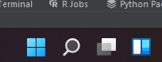
   
   2) In the Search dialog, type "Microsoft Store".
   
      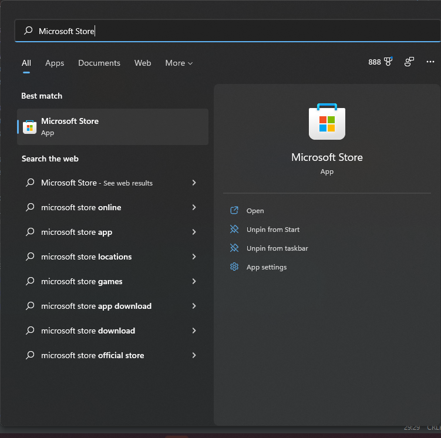
   3) In the Microsoft Store, type "Python". Then select Python 3.9.
   
      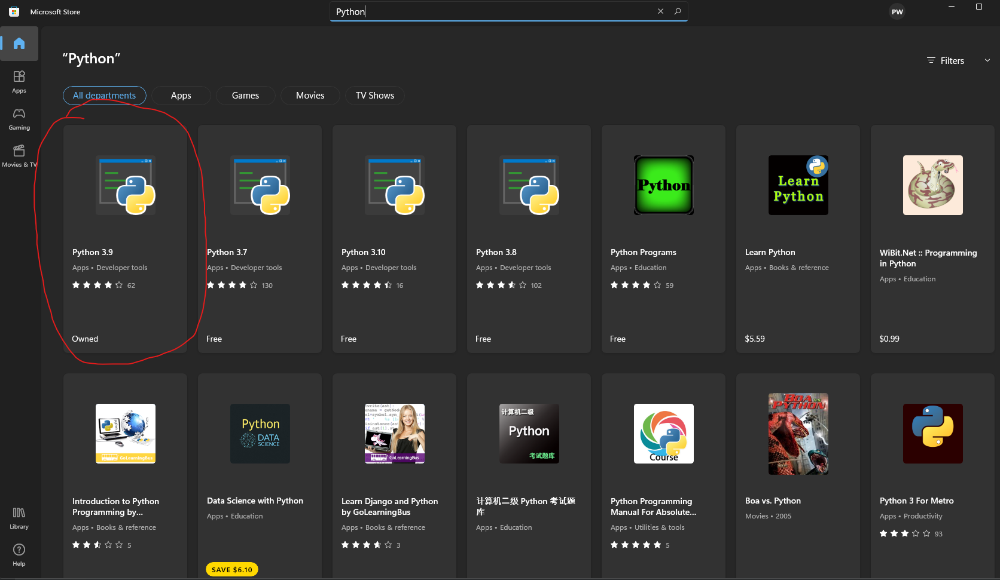
   4) Follow the installation instructions of Python 3.9 and note the full path in which Python is installed. This path 
will be used by the xlwings plugin.
2) Configure the Windows PATH variable to include Python and Python/scripts. 
   1) Open the Microsoft Store by selecting one of the search buttons.
   
      
   2) In the Search dialog, type "PATH". Windows will automatically recognize that PATH is configured in System 
Properties.
   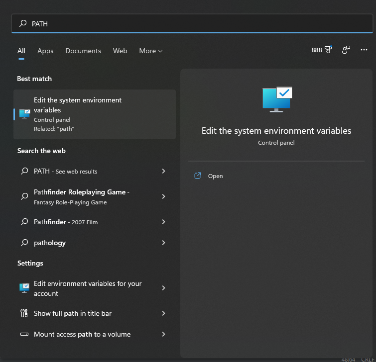
   
   3) In the System Properties dialog, click on Environment Variables.
   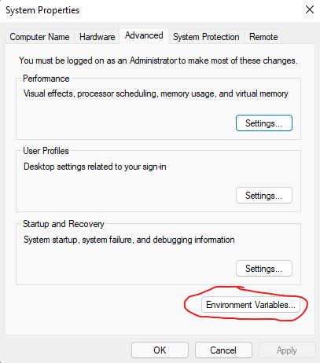
   
   4) In the Environment Variables dialog, select the Path variable from the user variables selection box.
   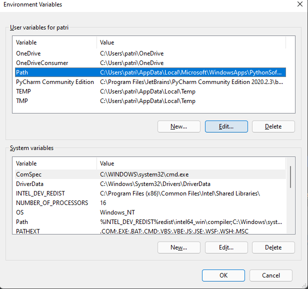
   
   5) Once the Path is highlighted, click on the Edit button, and in the Edit environment variable dialog, add the path 
to the Python39.exe. In my system, it is 
C:\Users\patri\AppData\Local\Microsoft\WindowsApps\PythonSoftwareFoundation.Python.3.9_qbz5n2kfra8p0. Once the path
is added, add also the path to the Python\scripts directory. 
Ex: C:\Users\patri\AppData\Local\Microsoft\WindowsApps\PythonSoftwareFoundation.Python.3.9_qbz5n2kfra8p0\scripts. Once 
these paths have been added, select the OK button to commit the newly added paths.
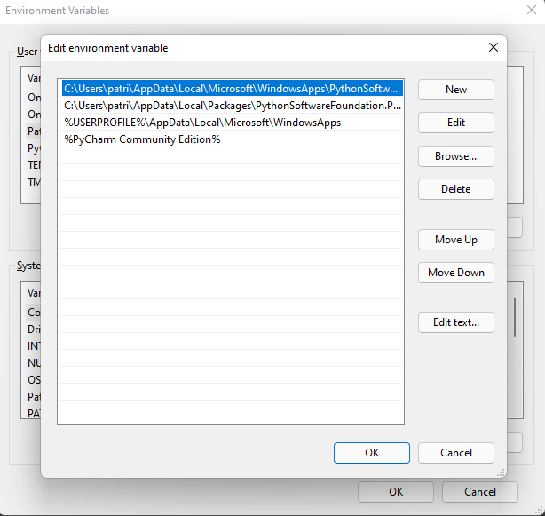

3) Install the xlwings plugin and xlwings. The user can see [Related Docs](#relateddocs) for the xlwings documentation. However,
I have extracted the relevant steps here: 
   1) Open cmd by first selecting one of the Windows search buttons.
   
      
   
   2) In the search dialog, type "cmd".
   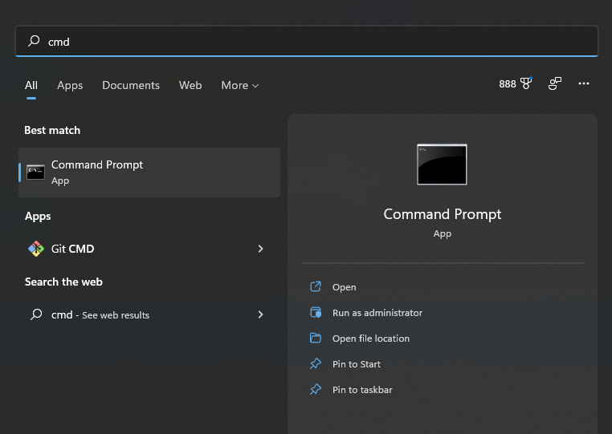
   
   3) In the Command Prompt window, type "pip install xlwings".
   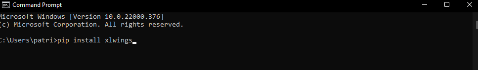
   
   5) Also in the Command Prompt window, type "xlwings addin install" to install the Excel plugin.
   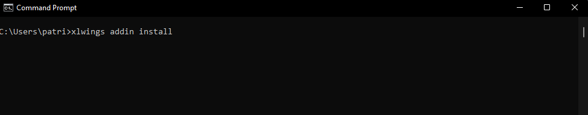

   6) Keep the Command Prompt window open before proceeding to the next step.
   
4) Install all the other libraries in the requirements.txt file which should be just the requests library since we have 
already installed xlwings in the above step.
   1) In the Command Prompt window, type "pip install requests".

5) Download and unzip the Github files.
   1) Download the files by click Code->Download Zip. Save this file somewhere such as your Documents 
   or Download folder.
   
   2) Unzip the file .zip download and note the full path of the unzipped folder's source-files directory. This path
will be needed in the xlwings plugin.
   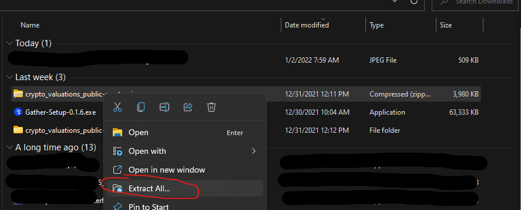

6) Once both the plugin and the Github file download are completed, the user can confirm the xlwings plugin installation
by starting Excel and confirming that a xlwings menu now appears in Excel. If the 
xlwings menu is in Excel, click on the xlwings menu. The user should see two variables that need to be configured:  
   1) Interpreter: This is the full path to the Python interpreter. Ex: C:\Users\user_name\AppData\Local\Microsoft
\WindowsApps\PythonSoftwareFoundation.Python.3.9_qbz5n2kfra8p0\python3.9.exe.
   2) PYTHONPATH: This is the full path to the directory containing the project source files. 
Ex: C:\Users\patri\Downloads\crypto_valuations_public-master\crypto_valuations_public-master\source-files.
   

7) Configs.py: As of V1.1, the configs CMC_IDS_COUNT and ID_REQUEST_LENGTH and have been added. The first 
configs equals how many CMC listings there are, and the second controls how many of these listings are 
aggregated together in single request to quotes/latest. Note that this is needed because trying to request
greater than ~800 IDs at once results in a 414 response and an error message that the URL is too long.

9) Configure the keys.py file 
   1) First, rename the supplied keys_sample.py to keys.py.  
   2) Then go to https://coinmarketcap.com/api/ and follow the steps to create a free account.
   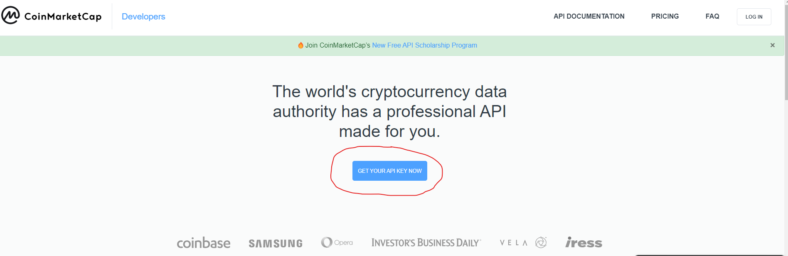

   3) Once you have the account, copy and paste the API key by selecting the COPY KEY button. This is the value that 
   will be assigned to CMC_API_KEY.
   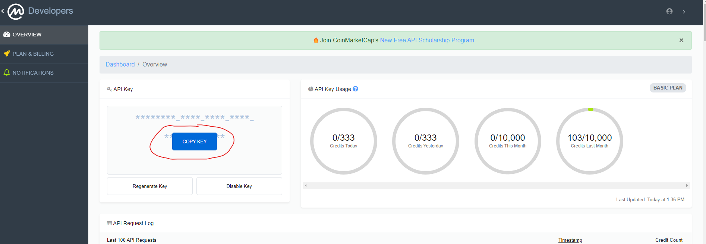
   

## Usage
Assuming all of the installation and configuration steps were completed, then click on the Run main button of 
the xlwings plugin. The Run main button will run the Python script crypto_valuations.py. All the Coinmarketcap and
Defillama listings and their market cap, fully-diluted market, and TVL will be updated in the cmc_ids tabs.

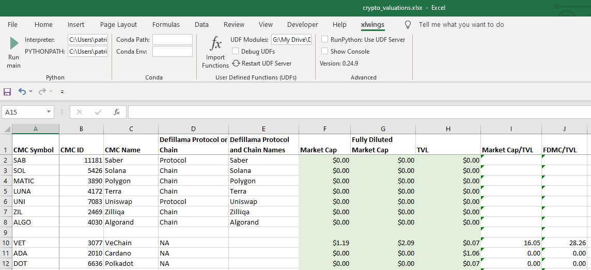

### A Note on the Excel Name and Structure 
Do not change the name of the Excel unless you also rename the Python script crypto_valuations.py because the xlwings 
plugin's Run main button looks for a Python script with the same name as the invoking Excel. 

1) CMC ID: This is the Coinmarketcap unique ID of the cryptocurrency. 
2) CMC Name: This is the corresponding non-unique name of the CMC ID. 
3) CMC Symbol: This is the corresponding non-unique symbol of the CMC ID.  
4) Defillama CMCId: This is the CMC ID listed on Defillama. This ID can be used to join the data between Coinmarketcap
and Defillma. 
5) Gecko ID: This is the Coingecko ID listed on Defillama. For now, it is included but not used. For the future, this
6) Defillama Slug: This is the unique slug (for procotols) and name (for chains) of a Defillama listing. For now, it is
included but not used. 
ID could be used for join Defillma data with Coingecko data. 
7) Market Cap: This is the market capitalization in billions of USD.
8) Fully-Diluted Market Cap: This is the market capitalization including those yet-to-be-released tokens times the 
current price in billions of USD. 
9) TVL: This is the total value locked in billions of USD.

The user can write formulas in columns 10 and 11 for MC/TVL and FDMC/TVL.  

## Related Docs
1) xlwings CE
   1) https://docs.xlwings.org/en/stable/installation.html
   2) https://github.com/xlwings/xlwings
2) Coinmarketcap API 
   1) https://coinmarketcap.com/api/
   2) https://coinmarketcap.com/api/documentation/v1/#section/Introduction
3) Defillama API
   1) https://docs.llama.fi/api
   2) https://github.com/DefiLlama/DefiLlama-Adapters
4) PyCharm https://www.jetbrains.com/pycharm/guide/tips/quick-docs/

## Roadmap 
Below are the planned versions. The roadmap has been updated as of V1.1.

### V1.0 
#### Version 1.0 
V1.0 uses xlwings's Excel plugin Run main button. See the Related Docs section for xlwings's interface methods. 
Version 1.0's Python script requires that crypto_valuations.xlsx's format remain as stated in the included example 
Excel.

#### Version 1.1 
V1.1 was repurposed so that a) the previously separate projects for reference data are now part of the crypto_valuations 
project and b) all listings on both Coinmarketcap and Defillama are automatically updated in the cmc_ids tab. There is
no longer a need for a separate watchlist and two sets of reference data.

### Version 1.2
As noted in What's New in V1.1, there is a very small cross-section between Coinmarketcap and Defillama listings, so 
that means the end goal of providing basic valuations for all listed coins is not yet achieved, so the next version 
will be to source more TVLs. 

#### Version 1.3
V1.3 will add additional metrics such as protocol revenue if I can find sources that can be parsed or queried. 
TVL is inert if no one is transacting while revenue and net income indicate usage and efficiency, respectively. See 
https://messari.io/article/state-of-compound-q3-2021?utm_source=newsletter&utm_medium=middle&utm_campaign=state-of-compound-q3 
for an example why metrics should go beyond TVL. 

### V2.0
Version 2.0 will be implemented as xlwings's User-Defined Function (UDF) so that the user can structure the Excel 
in any format and use the functions to have the values updated. I will likely include a short VBA script and button to 
kick off the re-evaluation.

## Licenses
xwlings CE is distributed under the BSD-3 License. See License.txt.
crypto_valuations is also distributed under the BSD-3 License. Also see License.txt.