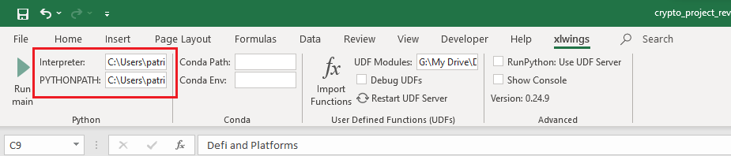
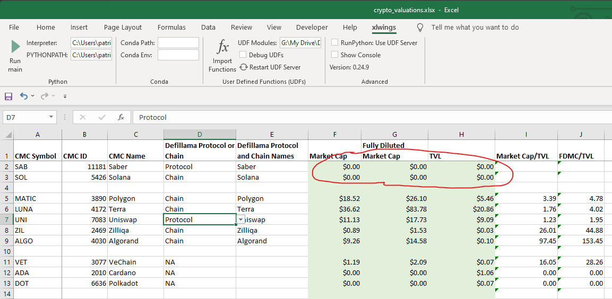
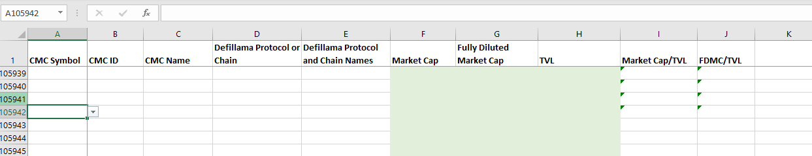

# Crypto Valuations Excel with Automated Market Cap and TVL Updates
## Overview
The purpose of the project is to use Excel to present some basic valuation metrics using market cap, fully-diluted 
market, and total value locked (TVL) so that the user can quickly perform a first-level assessment of potential crypto 
investments.

The purpose of the Python scripts is to automate the update of market cap, fully-diluted market cap and the TVL so that
the user does not have to search through dozens of pages and manually update the Excel.

## Project Content
This project contains the following files:
1) crypto_valuations.xlsx: This is the Excel that contains the chains and protocols that the user would like to 
evaluate.
2) crypto_valuations.py: This is the script that the xlwings plugin's Run main will call. 
3) coinmarketcap.py: This script calls the Coinmarketcap API to get the market value and fully-diluted market value.  
4) defillama.py: This script interacts with Defillama's API to get the TVL of chains and protocols.
5) configs.py: This scripts contains the configurations for DEV_MODE, DATA_FILE_PATH, CMC_API, and UNIT.
6) main.py: This file is for running the Python code without Excel for development and debugging.

## Installation
### Pre-requisites
1) A working copy of Excel. This project has been tested with Microsoft Office Home and Student 2019.
It should work with all version of Excel that works with the xlwings CE (henforth referenced as xlwings) plugin. 
2) See [Related Docs](#relateddocs) for xlwings compatibility with different versions of Excel.

### Installation
1) The xlwings plugin. See [Related Docs](#relateddocs) for the xlwings documentation. Once the plugin has been 
installed, the user needs to configure
   1) Interpreter Path: This is the full path to the Python interpreter. Ex: C:\Users\user_name\AppData\Local\Microsoft
\WindowsApps\PythonSoftwareFoundation.Python.3.9_qbz5n2kfra8p0\python3.9.exe.
   2) PYTHONPATH: This is the full path to the directory containing the project source files. 
Ex: C:\Users\user_name\Documents\Crypto\Crypto_Valuation\source-files.
   

2) See requirements.txt for the Python packages. 

Note: The Python packages need to be installed on the local site rather than just the venv of, for example, PyCharm. 

3) Copy all the files in this project, including the Excel, to PYTHONPATH.

### A Note on the data-files Folder
You'll notice that the project includes json files of cached responses from the Defillma APIs.
This is so that during development, I don't repeatedly hit the site for new data when new data are not required. 
The released version's config.txt has the DEV_MODE turned off so that each run pulls fresh data. If the user wishes 
to extend the code, it is recommended that you turn DEV_MODE to on. When new data is needed during 
development, just remove all the cached files in the data-file directory.

In configs.py, ensure DEV_MODE = 'OFF' and configure DATA_FILE_PATH to where you plan to store the files if you 
decide to turn DEV_MODE on. Note that DEV_MODE is used only for Defillama because of two reasons: 1) The 
Defillama endpoint returns all historical data, so the json is sizable and 2) the Defillama endpoint does not support
aggregation, so each protocol or chain's historical data can be easily saved as a separate file, making the saving
and checking for saved files much easier. The Coinmarketcap API supports both aggregation and current data query, so 
having DEV_MODE support is not as critical. 

## Usage
There are two ways to run the scripts, from PyCharm's or from the xlwings plugin's Run main button. 
To run the scripts from PyCharm, the user must have configured a project, interpreter, and directory structure. See 
the PyCharm documentation. For this README, we will focus on running from the xlwings plugin. 

Assuming the Interpreter and PYTHONPATH were configured correctly, and all the packages were installed, then 
click on the Run main button of the xlwings plugin. The xlwings plug-in will run the Python script crypto_valuations.py.

### A Note on the Excel Name and Structure 
Do not change the name of the Excel unless you also rename the Python script crypto_valuations.py because the xlwings 
plugin's Run main button looks for a Python script with the same name as the invoking Excel. 

Do not change the order of the Excel because the Python scripts assume the location and format of the Excel data, for 
example that the data start in cell A2 and that the Coinmarket.com Name is in the second column starting from A2. An 
explanation of all the columns: 
1) CMC Symbol: This is the Coinmarketcap symbol of the crypto-currency.
2) CMC ID: This is the Coinmarketcap unique ID of the crypto-currency. 
3) CMC Name: This is the corresponding non-unique name of the CMC ID. The Excel has vlookup to search this value by ID. 
4) Defillama Protocol or Chain: Defillama has a protocol API endpoint for all protocols (apps, dexes, or lending built 
on the chains) and a separate endpoint for the chains. This column tells the Python code which endpoint to use. 
5) Defillama Protocol and Chain Names: It is unfortunate that there is no unified naming for all chains and protocols. 
Ex: coinmarketcap calls LUNA terra-luna, but Defillama calls the same Terra, so the same chain must be named twice. 
The name is qualified by the dictionary of allowed names queried by the related project defillama_and_cmc_slugs. 
The user should use defillama_and_cmc_slugs to update the protocol and chain names from time to time.
6) Market Cap: This is the market capitalization of the available number of tokens multiplied by the current price in 
billions of USD. See coinmarketcap.com's definition.
7) Fully-Diluted Market Cap: This is the market capitalization including those yet-to-be-released tokens times the 
current price in billions of USD. 
8) TVL: This is the total value locked in billions of USD.
9) Market Cap/TVL: This is the free-float market cap divided by the TVL. The Excel contains the formula, so do not
overwrite. 
10) FDMC/TVL: This is the fully-diluted market cap divided by TVL. It is the same indicator, except this indicator 
includes all yet-to-be-released tokens.

Note that the Excel has formulas and data validation only until row 105954. The fact that CMC_IDs currently top out 
around 15000, this row range should leave plenty of room for expansion without bogging down the Excel.

## Related Docs
1) xlwings CE
   1) https://docs.xlwings.org/en/stable/quickstart.html
   2) https://github.com/xlwings/xlwings
2) Coinmarketcap API https://coinmarketcap.com/api/documentation/v1/#section/Introduction
3) Defillama API
   1) https://docs.llama.fi/api
   2) https://github.com/DefiLlama/DefiLlama-Adapters
4) PyCharm https://www.jetbrains.com/pycharm/guide/tips/quick-docs/
5) defillama_and_cmc_slugs: https://github.com/PCWCFA/defillama_and_cmc_slugs_public

## Roadmap 
Below are the planned versions. 

### V1.0 
#### Version 1.0 
V1.0 uses xlwings's Excel plugin Run Python button. See the Related Docs section for xlwings's interface methods. 
Version 1.0's Python script requires that crypto_valuation.xlsx's format remain as stated in the included example Excel.

#### Version 1.1 
V1.1 will add support for digitalcoinprice.com for protocols and chains currently not listed on defillama. 
Ex: VEChain, Cardano, and Polkadot. V1.1 will also fold the currently separate project defillama_and_cmc_slugs so that 
they write into crypto_valuations.xlsx's data qualification lists. It will save the user having to import the csv.

#### Version 1.2
V1.2 will add additional metrics such as protocol revenue if I can find sources that be parsed or queried. 
TVL is inert if no one is transacting while revenue indicates both usage and efficiency. See 
https://messari.io/article/state-of-compound-q3-2021?utm_source=newsletter&utm_medium=middle&utm_campaign=state-of-compound-q3 
as an example why metrics should go beyond TVL. 

### V2.0
Version 2.0 will be implemented as xlwings's User-Defined Function (UDF) so that the user can structure the Excel 
in any format and use the functions to have the values updated. I will likely include a short VBA script and button to 
kick off the re-evaluation.

## Licenses
xwlings CE is distributed under the BSD-3 License. See License.txt.
crypto_valuations is also distributed under the BSD-3 License. Also see License.txt.