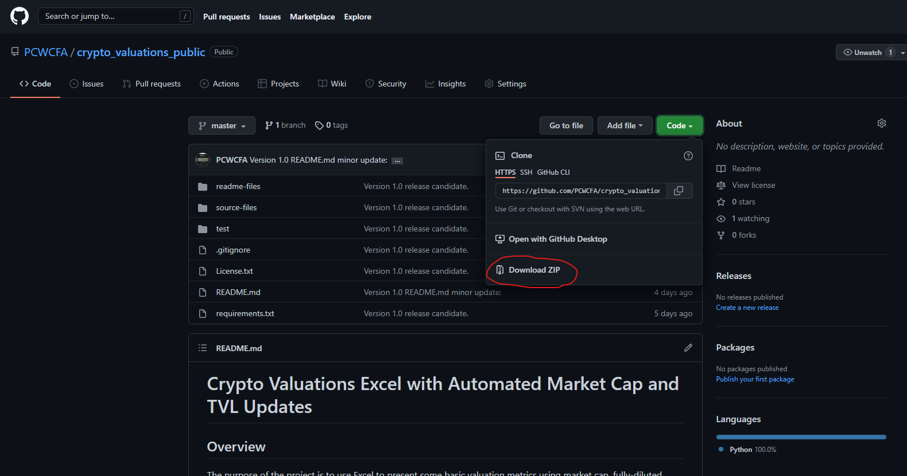
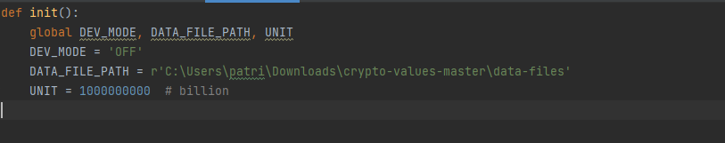
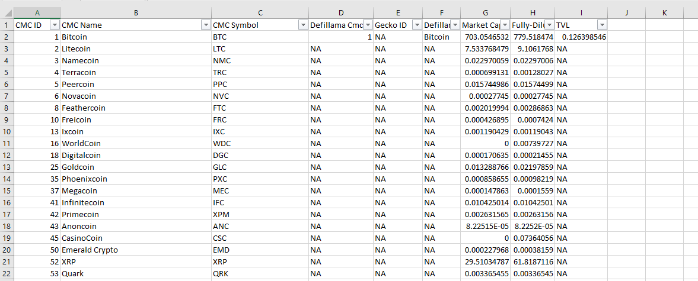

# Crypto Valuations Excel with Automated Market Cap and TVL Updates V1.1 
## Overview
The purpose of the project is to use Excel to present some basic valuation metrics using market cap, fully-diluted 
market, and total value locked (TVL) so that the user can quickly perform a first-level assessment of potential crypto 
investments.

The purpose of the Python scripts is to automate the update of market cap, fully-diluted market cap, and the TVL so that
the user does not have to search through dozens of pages and manually update the Excel.

## What Is New for Version 1.1
Version 1.1: 
1) Folds the previously separate project that updates the Coinmarketcap and Defillama reference data into 
crypto_valuations. Benefit: The user no longer needs to run the other project and then import the CSV to 
crypto_valuations.xlsx.
2) Combines the previously separate Coinmarketcap.com and Defillama reference data using the available cmc_id in the 
Defillama response. 
3) Gets rid of DEV_MODE because Defillama now has a current TVL for both protocols and chains, so needing to cache a 
bunch of historical TVLs to speed up development is no longer a need.

## Project Content
This project contains the following files:
1) crypto_valuations.xlsx: This is the Excel that contains the chains and protocols that the user would like to 
evaluate.
2) crypto_valuations.py: This is the script that the xlwings plugin's Run main button will call. 
3) coinmarketcap.py: This script calls the Coinmarketcap API to get the market capitalization and fully-diluted market 
capitalization.  
4) defillama.py: This script interacts with Defillama's API to get the TVL of chains and protocols.
5) configs.py: This script contains the configurations for DEV_MODE, DATA_FILE_PATH, and UNIT.
6) main.py: This file is for running the Python code without Excel for development and debugging.
7) keys.py: This script contains the API keys. For now, it is just the CMC_API_KEY. Note that this file is not checked
into the repository. The user will have to rename keys_sample.py to keys.py and place his own CMC API key.
8) keys_sample.py: This is the file that is to be renamed by the user to keys.py. 
9) cmc_api.py: This script updates the Coinmarketcap reference data in the crypto_valuations.xlxs cmc_ids tab.
10) defillama_slugs.py: This script updates the Defillama protocol reference data in the crypto_valuations.xlsx
Dictionary tab. 

## Installation
### Pre-requisites
1) A working copy of Excel. This project has been tested with Microsoft Office Home and Student 2019.
It should work with all version of Excel that works with the xlwings CE (henceforth referenced as xlwings) plugin. 
2) See [Related Docs](#relateddocs) for xlwings compatibility with different versions of Excel.

### Installation
The installation guide is for Windows.
1) Install Python 3.9 
   1) Open the Microsoft Store by selecting one of the search buttons.

       
   
   2) In the Search dialog, type "Microsoft Store".
   
      
   3) In the Microsoft Store, type "Python". Then select Python 3.9.
   
      
   4) Follow the installation instructions of Python 3.9 and note the full path in which Python is installed. This path 
will be used by the xlwings plugin.
2) Configure the Windows PATH variable to include Python and Python/scripts. 
   1) Open the Microsoft Store by selecting one of the search buttons.
   
      
   2) In the Search dialog, type "PATH". Windows will automatically recognize that PATH is configured in System 
Properties.
   
   
   3) In the System Properties dialog, click on Environment Variables.
   
   
   4) In the Environment Variables dialog, select the Path variable from the user variables selection box.
   
   
   5) Once the Path is highlighted, click on the Edit button, and in the Edit environment variable dialog, add the path 
to the Python39.exe. In my system, it is 
C:\Users\patri\AppData\Local\Microsoft\WindowsApps\PythonSoftwareFoundation.Python.3.9_qbz5n2kfra8p0. Once the path
is added, add also the path to the Python\scripts directory. 
Ex: C:\Users\patri\AppData\Local\Microsoft\WindowsApps\PythonSoftwareFoundation.Python.3.9_qbz5n2kfra8p0\scripts. Once 
these paths have been added, select the OK button to commit the newly added paths.

3) Install the xlwings plugin and xlwings. The user can see [Related Docs](#relateddocs) for the xlwings documentation. However,
I have extracted the relevant steps here: 
   1) Open cmd by first selecting one of the Windows search buttons.
   
      
   
   2) In the search dialog, type "cmd".
   
   
   3) In the Command Prompt window, type "pip install xlwings".
   
   
   5) Also in the Command Prompt window, type "xlwings addin install" to install the Excel plugin.
   

   6) Keep the Command Prompt window open before proceeding to the next step.
   
4) Install all the other libraries in the requirements.txt file which should be just the requests library since we have 
already installed xlwings in the above step.
   1) In the Command Prompt window, type "pip install requests".

5) Download and unzip the Github files.
   1) Download the files by click Code->Download Zip. Save this file somewhere such as your Documents 
   or Download folder.
   
   2) Unzip the file .zip download and note the full path of the unzipped folder's source-files directory. This path
will be needed in the xlwings plugin.
   

6) Once both the plugin and the Github file download are completed, the user can confirm the xlwings plugin installation
by starting Excel and confirming that a xlwings menu now appears in Excel. If the 
xlwings menu is in Excel, click on the xlwings menu. The user should see two variables that need to be configured:  
   1) Interpreter: This is the full path to the Python interpreter. Ex: C:\Users\user_name\AppData\Local\Microsoft
\WindowsApps\PythonSoftwareFoundation.Python.3.9_qbz5n2kfra8p0\python3.9.exe.
   2) PYTHONPATH: This is the full path to the directory containing the project source files. 
Ex: C:\Users\patri\Downloads\crypto_valuations_public-master\crypto_valuations_public-master\source-files.
   

7) Configure the configs.py.
   1) Open the configs.py in an editor (ex: PyCharm or Notepad). 
   2) Type DATA_FILE_PATH = 'The path where you have downloaded and unzipped the Github files.'
Ex: DATA_FILE_PATH = 'C:\Users\patri\Downloads\crypto_valuations_public-master\data-files.'
   3) The configs.py file should appear similar to below.
   
   4) New for version 1.1 is the ability to update the reference data by configuring UPDATE_REFERENCE_DATA = 'ON'. 

8) Configure the keys.py file 
   1) First, rename the supplied keys_sample.py to keys.py.  
   2) Then go to https://coinmarketcap.com/api/ and follow the steps to create a free account.
   

   3) Once you have the account, copy and paste the API key by selecting the COPY KEY button. This is the value that 
   will be assigned to CMC_API_KEY.
   
   

### A Note on the data-files Folder
In configs.py, ensure DEV_MODE = 'OFF' and configure DATA_FILE_PATH to where you plan to store the files even if you 
leave DEV_MODE = 'OFF'. Note that DEV_MODE is used only for Defillama because of two reasons: 1) The 
Defillama endpoint returns all historical data, so each json is sizable, and 2) the Defillama endpoint does not support
aggregation, so each protocol or chain's historical data can be easily saved as a separate file, making the saving
and checking for saved files much easier. The Coinmarketcap API supports both aggregation and current data query, so 
having DEV_MODE support is not as critical.

## Usage
Assuming all of the installation and configuration steps were completed, then click on the Run main button of 
the xlwings plugin. The Run main button will run the Python script crypto_valuations.py. I recommend that you zero (not
delete the values) in the Market Cap, Fully-Diluted Market Cap, and TVL cells to make it easier to see that the Python
scripts have indeed fetched new values. Note that I stated zero instead of delete because xwlwings uses blank cells to 
delimit the range of value it grabs from Excel. 

Correct: 

Incorrect: 

Because xlwings uses blank cells to delimit the range of data it grabs from Excel, the above example instructed xlwings 
to only update SAB and SOL because the blank row 4 served as a delimiter. If the user wants to update the values for 
additional chains or protocols, the user can remove the blank row in row 4. 

### A Note on the Excel Name and Structure 
Do not change the name of the Excel unless you also rename the Python script crypto_valuations.py because the xlwings 
plugin's Run main button looks for a Python script with the same name as the invoking Excel. 

Do not change the order of the Excel because the Python scripts assume the location and format of the Excel data, for 
example that the data start in cell A2 and that the CMC ID is column B. An 
explanation of all the columns: 
1) CMC Symbol: This is the Coinmarketcap symbol of the cryptocurrency.
2) CMC ID: This is the Coinmarketcap unique ID of the cryptocurrency. 
3) CMC Name: This is the corresponding non-unique name of the CMC ID. The Excel has vlookup to search this value by ID. 
4) Defillama Protocol or Chain: Defillama has a protocol API endpoint for all protocols (apps, dexes, and lending built 
on the chains) and a separate endpoint for the chains. This column tells the Python code which endpoint to use. 
5) Defillama Protocol and Chain Names: It is unfortunate that there is no unified naming for all chains and protocols. 
Ex: coinmarketcap calls LUNA terra-luna, but Defillama calls the same Terra, so the same chain must be named twice. 
The name is qualified by the dictionary of allowed names queried by the related project defillama_and_cmc_slugs. 
The user should use defillama_and_cmc_slugs to update the protocol and chain names from time to time.
6) Market Cap: This is the market capitalization of the available number of tokens multiplied by the current price in 
billions of USD. See coinmarketcap.com's definition.
7) Fully-Diluted Market Cap: This is the market capitalization including those yet-to-be-released tokens times the 
current price in billions of USD. 
8) TVL: This is the total value locked in billions of USD.
9) Market Cap/TVL: This is the free-float market cap divided by the TVL. The Excel contains the formula, so do not
overwrite. 
10) FDMC/TVL: This is the fully-diluted market cap divided by TVL. It is the same indicator, except this indicator 
includes all yet-to-be-released tokens.

Note that the Excel has formulas and data validation only until row 105,954. The fact that CMC_IDs currently top out 
around 15,000 should mean this row range will leave plenty of room for expansion without bogging down the Excel.

## Related Docs
1) xlwings CE
   1) https://docs.xlwings.org/en/stable/installation.html
   2) https://github.com/xlwings/xlwings
2) Coinmarketcap API 
   1) https://coinmarketcap.com/api/
   2) https://coinmarketcap.com/api/documentation/v1/#section/Introduction
3) Defillama API
   1) https://docs.llama.fi/api
   2) https://github.com/DefiLlama/DefiLlama-Adapters
4) PyCharm https://www.jetbrains.com/pycharm/guide/tips/quick-docs/

## Roadmap 
Below are the planned versions. 

### V1.0 
#### Version 1.0 
V1.0 uses xlwings's Excel plugin Run main button. See the Related Docs section for xlwings's interface methods. 
Version 1.0's Python script requires that crypto_valuations.xlsx's format remain as stated in the included example 
Excel.

#### Version 1.1 
V1.1 will add support for digitalcoinprice.com for protocols and chains currently not listed on defillama. 
Ex: VEChain, Cardano, and Polkadot. V1.1 will also fold the currently separate project defillama_and_cmc_slugs so that 
they write into crypto_valuations.xlsx's data qualification lists. It will save the user from having to import the 
reference data.

#### Version 1.2
V1.2 will add additional metrics such as protocol revenue if I can find sources that can be parsed or queried. 
TVL is inert if no one is transacting while revenue and net income indicate usage and efficiency, respectively. See 
https://messari.io/article/state-of-compound-q3-2021?utm_source=newsletter&utm_medium=middle&utm_campaign=state-of-compound-q3 
for an example why metrics should go beyond TVL. 

### V2.0
Version 2.0 will be implemented as xlwings's User-Defined Function (UDF) so that the user can structure the Excel 
in any format and use the functions to have the values updated. I will likely include a short VBA script and button to 
kick off the re-evaluation.

## Licenses
xwlings CE is distributed under the BSD-3 License. See License.txt.
crypto_valuations is also distributed under the BSD-3 License. Also see License.txt.