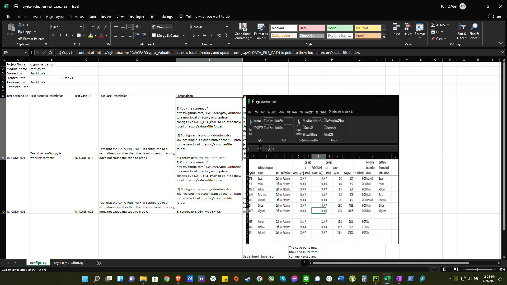

# Tests
All the test cases are accompanied by an Excel of the same name. Ex: tc_conf_001.xlsx and tc_cv_001.xslx. The
pre-conditions, post conditions, and results are captured in the crypto_valuation_test_cases.xlsx as Excel comments 
in the Actual Results column. You can see these comments by having the mouse pointer in the cell.

 

See test/crypto_valuation_test_cases_V1.1.xlsx for the test cases and results.
